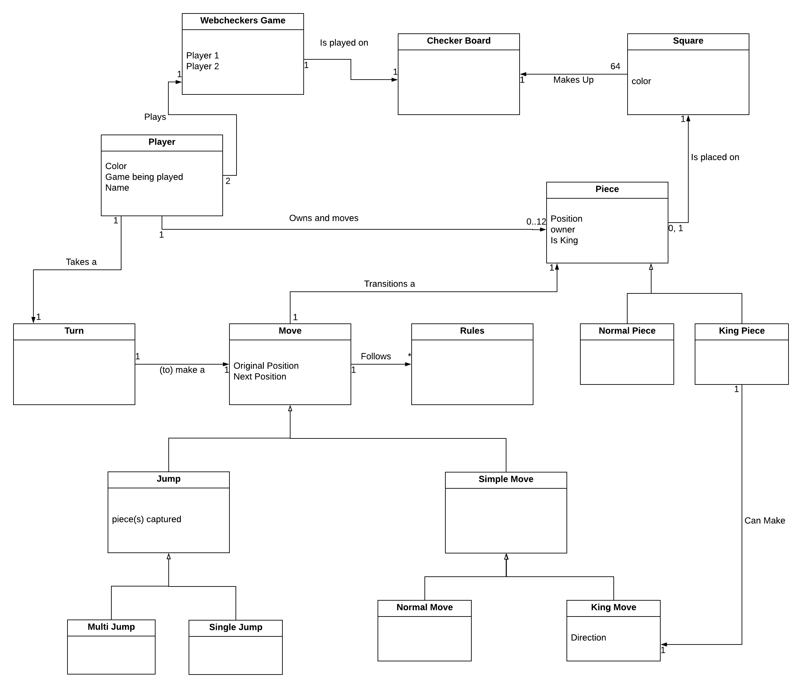
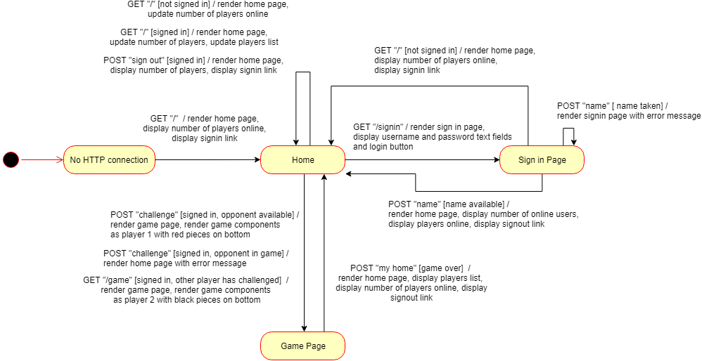

# WebCheckers Design Documentation

# Team Information
* Team name: D
* Team members
  * Andy Gin
  * Anthony Amassicci
  * Adrian Postolache
  * Samuel Keir
  * Zachary Eberhardt

## Executive Summary

This is the design documentation for the WebCheckers application. The documentation first covers purpose and requirements of the application, describing the vision of the project. Following is the Application Domain, illustrating the problem space of the application and the entities involved in playing a checkers game. The Web Architecture is next described, illustrating a high level view of the tiers and models and how the web technologies fit in the application. An overview of the User Interface is then shown, giving a user an idea of what he/she might expect to see throughout the application's pages. Finally, a summary of how the application works at each tier in the architecture is given to revel more of the design's inner workings.

### Purpose
> Provide a very brief statement about the project and the most important user group and user goals.

This project is about creating a checkers game online so that players can play against their friends or random opponents to have fun.

### Glossary and Acronyms
> Provide a table of terms and acronyms.

| Term | Definition |
|------|------------|
| VO | Value Object |

## Requirements

This section describes the features of the application.

> In this section you do not need to be exhaustive and list every story.  Focus on top-level features from the Vision document and maybe Epics and critical Stories.

### Definition of MVP
> Provide a simple description of the Minimum Viable Product.

A MVP of this product is a checkers game that allows a user to chose their opponent from a list of other users in a lobby. 
Once an opponent is chosen the two of you will be able to play a simple game of checkers in which you can move your pieces 
forward by stepping or jumping over opponents pieces. A game will be won once either all your or your  opponents pieces 
are taken or either player has no more moves. 

### MVP Features
> Provide a list of top-level Epics and/or Stories of the MVP.

Player Sign-in
Start a Game
Movement Epic
    Step move
    Simple Capture
    Multi Jump
    Become a King
    King Movement
    Backup Move
Winning/Losing Game
Resign

### Roadmap of Enhancements
> Provide a list of top-level features in the order you plan to consider them.

Spectator
Player Help button and window

## Application Domain

This section describes the application domain.

The domain model above models the problem space of a Checkers game and covers the different parts of a game. Starting at the top is the WebCheckers Game, which is the overarching entity that the rest of the model considers to illustrate the different parts of the game.

The game is played on an 8x8 Checker Board which is made of 64 alternating black and white squares. There may be pieces on the squares, which can be normal pieces or a king pieces. Furthermore, 2 Players play the game, taking turns to make Moves that transition the pieces and move the game along.

A Move entity is broken down into two categories: a Jump, which is further broken down into a Multi Jump and a Single Jump, and a Simple Move, which is further broken down into a Normal Move and a King Move. All Moves adhere to the rules of Checkers.

## Architecture

This section describes the application architecture.

### Summary

The following Tiers/Layers model shows a high-level view of the webapp's architecture.

As a web application, the user interacts with the system using a browser.  The client-side
of the UI is composed of HTML pages with some minimal CSS for styling the page.  There is also
some JavaScript that has been provided to the team by the architect.

The server-side tiers include the UI Tier that is composed of UI Controllers and Views.
Controllers are built using the Spark framework and View are built using the FreeMarker framework.  The Application and Model tiers are built using plain-old Java objects (POJOs).

Details of the components within these tiers are supplied below

### Overview of User Interface

This section describes the web interface flow; this is how the user views and interacts
with the WebCheckers application.

Users initially have no connection to the page. A user is directed to the Home page upon making a connection to the server. At the Home page, the number of users is displayed along with a link to signin.

The sign in link directs the user to the Sign In page with one text field to input a name and a button to sign in. If the name is taken, it will display a error message on the same page. If the name is available, the user is redirected to the home page, now with a list of online players displayed and a signout link instead of a signin one.

The Home page refreshes every 5 seconds, updating the player list and number of players. If the user signs out, the signin button is displayed again and the player list is no longer displayed.

Otherwise, the user may select an online player and issue a challenge, in which case the user is directed to the Game page. The game components are rendered with the user playing as red and the opponent playing as black.

If the user is challenged by another player in the home page, the Game page is also rendered with the user playing as black and the opponent as red.

When the game is over, the user may click on the home link to return to the Home page.

### UI Tier
> Provide a summary of the Server-side UI tier of your architecture.
> Describe the types of components in the tier and describe their responsibilities.

#### Static models
> Provide one or more static models (UML class or object diagrams) with details such as critical attributes and methods.

#### Dynamic models
> Provide any dynamic models, such as state and sequence diagrams, as is relevant to a particularly significant user story.
> For example, in WebCheckers you might create a sequence diagram of the `POST /validateMove` HTTP request processing or you might use a state diagram if the Game component uses a state machine to manage the game.

### Application Tier
> Provide a summary of the Application tier of your architecture.
> Describe the types of components in the tier and describe their responsibilities.

#### Static models
> Provide one or more static models (UML class or object diagrams) with some details such as critical attributes and methods.

#### Dynamic models
> Provide any dynamic model, such as state and sequence diagrams, as is relevant to a particularly significant user story.

### Model Tier
> Provide a summary of the Model tier of your architecture.
> Describe the types of components in the tier and describe their responsibilities.

#### Static models
> Provide one or more static models (UML class or object diagrams) with some details such as critical attributes and methods.

#### Dynamic models
> Provide any dynamic model, such as state and sequence diagrams, as is relevant to a particularly significant user story.
