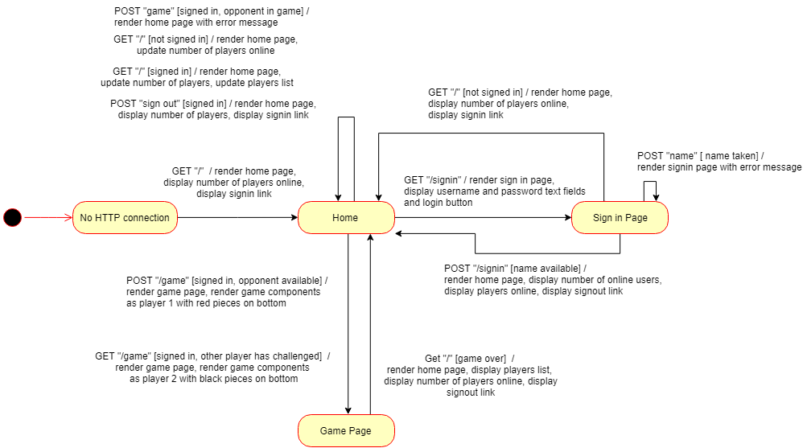
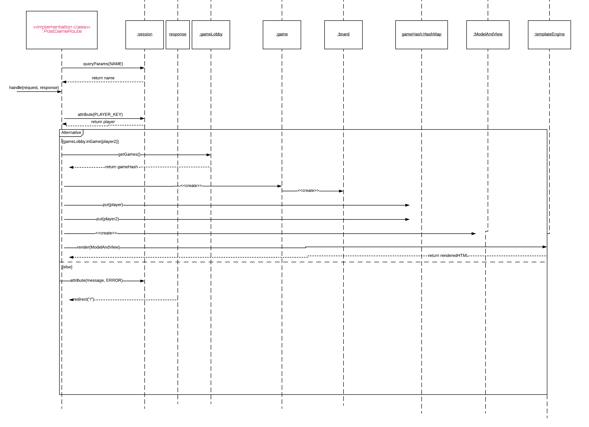
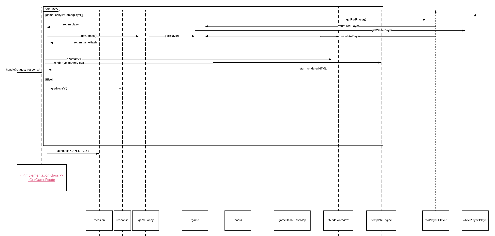
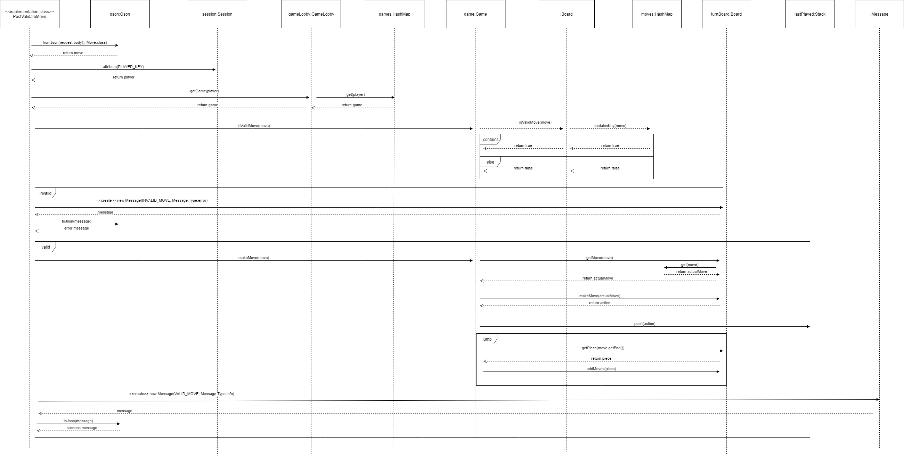
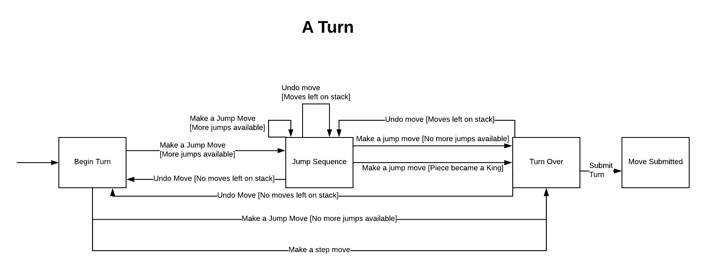

# WebCheckers Design Documentation

# Team Information
* Team name: D
* Team members
  * Andy Gin
  * Anthony Amassicci
  * Adrian Postolache
  * Samuel Keir
  * Zachary Eberhardt

## Executive Summary

This is the design documentation for the WebCheckers application. The documentation first covers purpose and requirements of the application, describing the vision of the project. Following is the Application Domain, illustrating the problem space of the application and the entities involved in playing a checkers game. The Web Architecture is next described, illustrating a high level view of the tiers and models and how the web technologies fit in the application. An overview of the User Interface is then shown, giving a user an idea of what he/she might expect to see throughout the application's pages. Finally, a summary of how the application works at each tier in the architecture is given to revel more of the design's inner workings.

### Purpose

This project is about creating a checkers game online so that players can play against their friends or random opponents to have fun.

### Glossary and Acronyms

| Term | Definition |
|------|------------|
| VO | Value Object |
| MVP | Minimum Viable Product |
| UI | User Interface |
| OS | Operating System |
| POJO | Plain Old Java Object |
| HTML | Hypertext Markup Language |
| CSS | Cascading Style Sheets |

## Requirements

Major requirements include sign in/sign out, starting a game, movement in game, and ending a game. Further enhancements required are a help menu which tells a player the moves available and spectating a game, in which a user may spectate an ongoing game.

### Definition of MVP

The Minimum Viable Product of the application is a checkers game that allows a user to choose their opponent from a list of other users in a lobby. Once an opponent is chosen the two players will be able to play a simple game of checkers in which they can move their pieces. Each move can go forward by stepping or jumping over opponents pieces. A game will be won once either all your or your opponents pieces are taken or either player has no more moves.

Upon reaching the opponent end of the board, a piece can be promoted to a king in which that piece may move forward or backwards. A king cannot move again upon promotion. If a piece can jump an opponent piece, that piece must make a jump move that turn. If the jump results in a position where the piece may make another jump, it must do so. The only exception to this is if a piece jumps another piece and is promoted to a king, in which case it cannot move further.

### MVP Features

Player Sign-in: A user should be able to sign in if they are not signed in already. They should sign in with an unused username and given an error if it is not available.
Start a Game: A player should be able to start a game by challenging another player that is not in a game already by checking the radiobox next to the other player's name and clicking challenge.
Movement Epic: Moves that can be made during a player's turn.
   	Step move: A piece can make any normal step as long as no jumps are available.
    Simple Capture: A piece must make a capture if one is available.
    Multi Jump: A piece must make a another capture if a capture is available after a one has already been made.
    Become a King: A piece will be promoted to a king upon reaching the end of the board. The turn should terminate after this action (no other actions available).
    King Movement: A king piece should be able to move and jump forwards and backwards.
Winning/Losing Game: A game should be lost when a player has no moves available. The other player is then the winner.
Resign: A player should be able to resign from a game at any time.

### Roadmap of Enhancements

Spectator: A player should be able to see a list of players in games and spectate their games by checking the radiobox and clicking spectate. A player spectating a game should not be able to be challenged to game.
Player Help: A player should be able to request help from the application by clicking a help button to see the available moves he/she can make highlighted.

## Application Domain

This section describes the application domain.

The domain model above models the problem space of a Checkers game and covers the different parts of a game. Starting at the top is the WebCheckers Game, which is the overarching entity that the rest of the model considers to illustrate the different parts of the game.

The game is played on an 8x8 Checker Board which is made of 64 alternating black and white squares. There may be pieces on the squares, which can be normal pieces or a king pieces. Furthermore, 2 Players play the game, taking turns to make Moves that transition the pieces and move the game along.

A Move entity is broken down into two categories: a Jump, which is further broken down into a Multi Jump and a Single Jump, and a Simple Move, which is further broken down into a Normal Move and a King Move. All Moves adhere to the rules of Checkers.

## Architecture

This section describes the application architecture.

### Summary

The following Tiers/Layers model shows a high-level view of the webapp's architecture.

As a web application, the user interacts with the system using a browser.  The client-side
of the UI is composed of HTML pages with some minimal CSS for styling the page.  There is also
some JavaScript that has been provided to the team by the architect.

The server-side tiers include the UI Tier that is composed of UI Controllers and Views.
Controllers are built using the Spark framework and View are built using the FreeMarker framework.  The Application and Model tiers are built using plain-old Java objects (POJOs).

Details of the components within these tiers are supplied below

### Overview of User Interface

This section describes the web interface flow; this is how the user views and interacts
with the WebCheckers application.

Users initially have no connection to the page. A user is directed to the Home page upon making a connection to the server. At the Home page, the number of users is displayed along with a link to signin.

The sign in link directs the user to the Sign In page with one text field to input a name and a button to sign in. If the name is taken, it will display a error message on the same page. If the name is available, the user is redirected to the home page, now with a list of online players displayed and a signout link instead of a signin one.

The Home page refreshes every 5 seconds, updating the player list and number of players. If the user signs out, the signin button is displayed again and the player list is no longer displayed.

Otherwise, the user may select an online player and issue a challenge, in which case the user is directed to the Game page. The game components are rendered with the user playing as red and the opponent playing as black.

If the user is challenged by another player in the home page, the Game page is also rendered with the user playing as black and the opponent as red.

When the game is over, the user will be redirected to the home page automatically.

If a player resigns, he/she will be redirected to the home page. The other user will be redirected if they are waiting for his/her turn. If it is the other user's turn, he/she will be notified about the resignation upon trying to make a move and will be redirected after clicking submit.

### UI Tier

The WebSever class sets up the routes for the UI tier. The GetHomeRoute class initializes the webcheckers server. Our GET routes and post routes for sign-in cooperate to populate the player lobby with signed-in players. Furthermore, our GET and POST routes for the game work in unison to pull players into a game once a challenge has been issued. The POST game route is used to handle the challenger clicking the button to challenge the opponent and the GET game route is used to enter a game if the player has been challenged by another player. While the game is running, our post routes for validate move, check turn, and submit turn operate in order to keep the game loop functional. At any time, if a player attempts to sign out, the get route for signing out handles the calls and completes the request.

#### Static models
Part 1

Part 2

Part 3

Part 4

Part 5

#### Dynamic models
PostGameRoute Sequence Diagram

GetGameRoute Sequence Diagram

PostValidateMove Sequence Diagram

### Application Tier
The Application tier contains the GameLobby and PlayerLobby classes and keeps track of all of the players in the lobby and the ongoing games. The PlayerLobby class also signs in players by adding them to its map of players. The GameLobby can be used to find the players in a particular game and notify a user if he/she has been challenged. It also puts both players into a game when a user challenges another player.

#### Static models

### Model Tier

The game and board classes are the main classes in the Model Tier. The game class implements the functionality of the game loop and keeps it running while players are participating in a webcheckers match. Player is a representation of the users participating in the game. The board keeps track of the pieces and the state of the turns for the players. Color, piece, row, and space all represent their corresponding features inside the board, and are interacted with in order to keep the game loop functional and accurate to the rules for checkers. The moves package includes all of the implementation for the different types of moves that occur in checkers, ranging from jumps to kinging
and more.

#### Static models
Part 1

Part 2

Part 3

Part 4

#### Dynamic models

### Object Oriented Design
####Polymorphism
We use polymorphism with our Direction interface with its enum implementers since it allows us to have generic collections of them regardless of if they’re directions for a king or for a normal piece. We also have Jump and Step extending from the Move class, giving them the common methods of a move and allowing them to branch off with methods that make them different from each other.

####Pure Fabrication
Purely fabricated classes such as PlayerLobby and GameLobby classes do not exist in the problem domain. These classes help reduce coupling and increase cohesion between the different architectural tiers. Since these two classes are in the Application tier, the tier itself helps decrease coupling between the UI and Model tier classes. In the UI UML diagram part 2, we can see clearly how the GameLobby class decreases coupling greatly between UI and Model.

####Controller
The Application tier classes also demonstrate the Controller principle by handling different system events. PlayerLobby handles signing in players, signing out players, and keeping track of spectators. GameLobby handles putting players into a new game and ending a game by removing players from said game.

### Code Coverage
#### UI Tier
UI Coverage Report

Overall, the coverage of the UI Tier is at 95%, covering most important aspects of the code. The least coverage comes from the GetHomeRoute, BoardView, and RowView classes where some lines were missed in the coverage. These lines would optimally be covered, but they are less important because some of the cases cannot be reached normally. For the most part, the routes have 100% coverage. However, some of the other UI routes do not have full coverage because of some of the lines dealing with JSON message passing.

#### Application Tier
Application Coverage Report

The application tier has 76% coverage, the weakest of the three tiers. The weakest link of the application tier tests is the PlayerLobby class with 59% coverage. The GameLobby class also has suboptimal coverage at 78% coverage. Most of the gaps in coverage stem from the construction of new objects, in which we had trouble mocking and testing.

#### Model Tier
Model Coverage Report

Moves Coverage Report

The model tier is composed of two main parts, the Model package itself and the Moves package within the Model Package. The average of the two come up to 87% with the model being being the weaker of the two links. The weakest links of all the classes are the Game, Move, Position, and Player classes. These gaps also come from missed lines to do with constructing objects and also some insignificant cases.

### Code Metrics
####Complexity Metrics

The average cyclomatic complexity (excluding abstract classes) is 1.33 and the overall average is 5.70. The standout complexity from the average is the GetGameRoute, which may stem from the amount of system processes it needs to organize. For example, it has to deal with entering a game, spectating a game, and redirecting players once a game is over in all scenarios. This leads to different method calls and a more complex system of conditionals. GetHomeRoute is similar in this case, in which it deals with many scenarios.
The standout for the overall average is the Board class. This means the class is much harder to test and get coverage for, as demonstrated in the code coverage anaylsis. The methods and complexity of this class is high because it handles much of the game's behavior and does most of the checks for the game state. Twin methods with different parameters for different tasks occured a few times, makes it more complex as well.

####Lines of Code Metrics

The lines of code metrics with respect to packages makes sense. The UI and model (model + moves packages) tier both contain around 2000 lines of code (including comments) while the application tier is much less.

####Javadocs Metrics

Our Javadoc coverage for fields is at 19.58%. Many of the fields not covered with Javadocs are self-evident by name. These include constants and may include mock and friendly objects within unit tests as well. Although the names may be self-evident, it is good practice to document everything so this category needs to be improved.
Our method coverage is about 70%. Many of the missed documentation most likely stems from self-evident naming of unit test methods, but there may have been some methods missed in the main application. This should be improved as it is the most important aspect.

####Martin Package Metrics

The average afferent coupling (Ca) is 14. The UI tier has 22 instances where a class references to another class within the package. This mainly stems from the sharing of constants through all of the UI classes. This also affects the other tiers, but not as severely. The model tier naturally has a higher afferent coupling rating because the different entites need to work together and reference each other to connect the game. The application tier is the lowest and includes minor cases, including constant sharing.
The average efferent coupling (Ce) is 27.80, which is moderately high but also within expectations considering the architecture. Most of the references to other packages stem from the UI, which reference to classes from both the model and application tiers. The application tier helps lessen the coupling between the model and UI tiers. It is necessary for the UI to do this because it needs to update the display accordingly with information from the model.

####Chibamber-Kemerer Metrics

This metric describes the coupling of classes by their amound of dependencies and the amount in which other classes depend on a specific class. Classes with particularly high dependency ratings are Player (33), Piece (22), Move (21), Game (30), Board (23), and GameLobby (27).

###Redesign and Reimplementation Recommendations
####Constants Class
As seen in the Martin Package metrics, the afferent and efferent coupling within the UI tier is very high due to the sharing of constants through the entire application. The majority of constants are defined in the Webserver clas or throughout the many UI classes. Having a separate class just for constant definition may help reduce this coupling greatly.

####Model Refactoring
As aforementioned, the board class is somewhat of a "god class" and handles too much behavior. This results in very high cyclomatic complexity and affects the coverage and modularity of the application greatly. We had previously recommended to refactor the model design by giving more responsibilities to other classes connected to Board in the model. The decrease in responsibility would decrease the complexity and also make it easier to test.

####Spectator Implementation Change
As seen in the complexity metrics, the GetHome and GetGame routes have high cyclomatic complexity. This may be due to the way we implemented the Spectator enhancement. Rather than implementing the JavaScript files, we had tweaked and "hacked" the application, specifically in GameLobby, GetHomeRoute, and GetGameRoute. Doing so adds complexity to these routes because it adds a whole suite of new scenarios to consider including more conditionals and handling a spectator's behavior. Implementating it the intended way may reduce complexity.

####State Management
The game states in our code is spread out through the model and largely implicity. This makes it more complex to think about and also more difficult to maintain and test. Implementating a new feature would require a lot of tracing. A way to improve this might be to use explicit states and organize them into few classes, probably the Game or Board class.

####UI Refactoring
There are many checks spread out through the UI tier where the application checks if a player is logged in or in a game. These checks run frequently throughout the whole application. A way to reduce repititon may be to use spark middleware or possibly decorators.